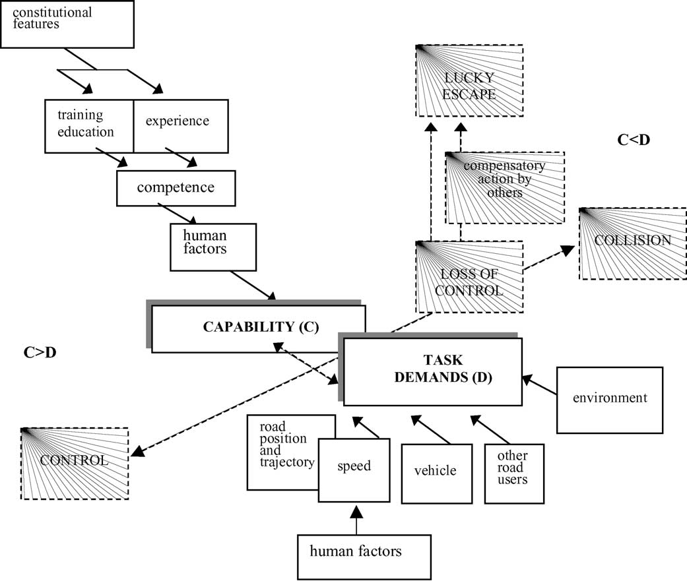
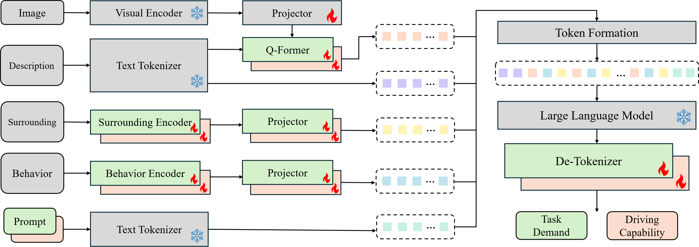
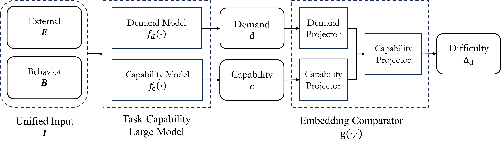

# From Concept to Representation: Modeling Driving Capability and Task Demand with a Multimodal Large Language Model

> Official implementation of “**From Concept to Representation: Modeling Driving Capability and Task Demand with a Multimodal Large Language Model**”\
> published in *Sensors (MDPI), Vol. 25, Issue 18, 2025*.\
> DOI: [10.3390/s25185805](https://doi.org/10.3390/s25185805)

## 📘 Overview

This repository provides an implementation of modeling **the Fuller's Task–Capability Interface (TCI) model** [(ref)](https://www.sciencedirect.com/science/article/pii/S0001457505000102) for driving safety, based on a multimodal large language model (MLLM).

<p align="center">
  
</p>

The proposed framework aims to explicitly represent **task demand** and **driving capability**
from heterogeneous driving data, including scene images, natural language descriptions,
driver control signals, and surrounding traffic states. Both task demand and driving capability
are encoded as low-dimensional semantic embeddings in a shared latent space, enabling
direct comparison between the two.

<p align="center">
  
</p>

By measuring the discrepancy between task demand and driving capability, the framework
produces an interpretable estimate of **task difficulty**, which can be used to identify
capability shortfalls before unsafe driving behavior emerges. 

<p align="center">
  
</p>

Experiments on both simulated and actual driving scenarios demonstrate that the learned embeddings
are task-consistent, sensitive to capability degradation (e.g., alcohol impairment),
and transferable to real-world motorway data without additional fine-tuning. The framework
offers a concise and explainable step toward proactive risk assessment in intelligent
driving systems.

---

## 🛠 Installation

The code is developed with the following setup:

- OS: Ubuntu 24.04 (Linux x86_64)
- Conda: 24.11.1
- Python: 3.10
- CUDA: 11.8
- GPU: NVIDIA RTX A6000 (48GB) * 4

> Details of the experiment enviroment is listed in [environment](environment.yml).

1. Install Miniconda (Linux x86_64)

```Shell
wget https://repo.anaconda.com/miniconda/Miniconda3-latest-Linux-x86_64.sh
bash ~/Miniconda3-latest-Linux-x86_64.sh
source ~/.bashrc
```
> If you encounter any problems, please refer to [Install Minicoda](https://www.anaconda.com/docs/getting-started/miniconda/install) for details.

---

2. Clone the repo and build the environment

```Shell
git clone https://github.com/HanaRo/TCI-represent.git
cd TCI-represent
conda create -n tci python=3.10
conda activate tci
cd LAVIS
pip3 install -r requirements.txt
python setup.py develop # if you have installed LAVIS before, please uninstall it
```

## 🚀 Usage

### Dataset

The dataset used in this project is not publicly available due to privacy
and institutional restrictions. 

For reproducibility purposes, the directory structure and data format
are documented in this repository.
Please refer to the [document](data/README.md) for details.

---

### Training and evaluating

This project adopts a two-stage training/evaluating process: 
(1) a MLLM for obtaining the representation of task demand and driving capability;
(2) a learnable comparator two compare the representations and output task difficulty.

---

#### MLLM

To train the MLLM part:

```Shell
cd TCI-represent
bash scripts/init.sh
cd LAVIS
# bash run.sh [NODE] [GPU_NUM] [CONFIG] 
bash run.sh node_name 4 lavis/projects/tcdui/train/prompt_llava15_v3_w2_demand.yaml
```

> Slurm is used in ``run.sh``.
> Please change the script to your config.

To obtain the representation of task demand and driving capability:

```Shell
cd TCI-represent
bash scripts/init.sh
cd LAVIS
# bash run.sh [NODE] [GPU_NUM] [CONFIG] 
bash run.sh node_name 4 lavis/projects/tcdui/infer/prompt_llava15_v3_demand_test_f8.yaml
```
---

#### Comparator

To train the comparator:

```Shell
cd TCI-represent
# bash scripts/train.sh [CFG] [NODE]
bash scripts/train.sh config/config_name.py node_name

```

For evaluation:

```Shell
cd TCI-represent
# bash scripts/infer.sh [CFG] [CKPT]
bash scripts/infer.sh config/config_name.py path_of_ckpt
```

---


## 📄 License

This code is released under the GNU General Public License v3.0 (GPL-3.0).

For academic use, please also cite the associated paper as described in the
[Citation](#citation) section.

See the [LICENSE](LICENSE) file for full license text.

---

## 📚 Citation

If you find this repository useful for your research, please consider citing our paper:

```bibtex
@article{zhou2025concept,
  title={From Concept to Representation: Modeling Driving Capability and Task Demand with a Multimodal Large Language Model},
  author={Zhou, Haoran and Carballo, Alexander and Fujii, Keisuke and Takeda, Kazuya},
  journal={Sensors},
  volume={25},
  number={18},
  pages={5805},
  year={2025},
  publisher={MDPI}
}
```

---

## 🙏 Acknowledgments

This work was supported by:

- **Nagoya University**, Graduate School of Informatics
- **DENSO CORPORATION**, Advanced Research & Innovation Center (ARIC)
- **Japan Science and Technology Agency (JST) SPRING Program**, Grant No. **JPMJSP2125**
- “**THERS Make New Standards Program for the Next Generation Researchers**”

This implementation was also benefited from following repositories:

- [LAVIS](https://github.com/salesforce/LAVIS)
- [LMDrive](https://github.com/opendilab/LMDrive)

---

## ✉️ Contact

**Corresponding Author:**\
🧑‍🔬 Haoran Zhou (Nagoya University)\
📧 [zhou.haoran@g.sp.m.is.nagoya-u.ac.jp](mailto\:zhou.haoran@g.sp.m.is.nagoya-u.ac.jp)\
📧 [hanaro.chou@gmail.com](mailto\:hanaro.chou@gmail.com)

---